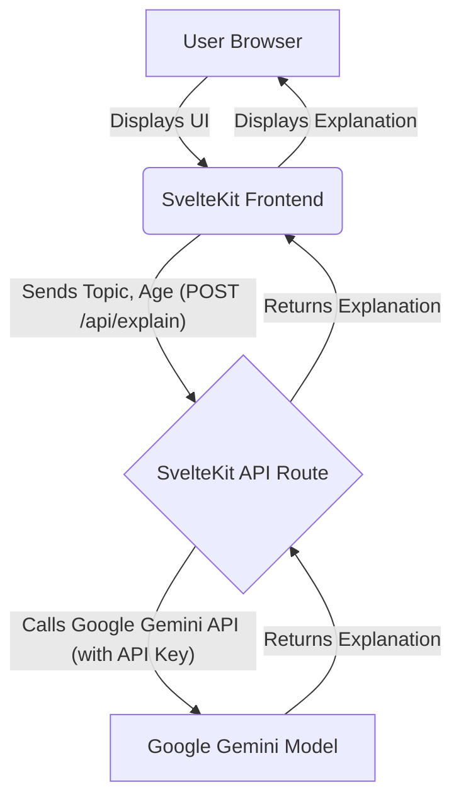

# Project Specification: Explain Like I am X (ELIx)

## 1. Project Overview

ELIx is a web application designed to simplify complex topics by leveraging the Google Gemini API. Users will input a topic and specify an "age" (X). The application will then query the Gemini API to generate an explanation tailored to that age level, displaying the result on the page.

## 2. Technology Stack

*   **Frontend Framework:** SvelteKit (building on the existing project structure)
*   **Styling:** Existing project CSS setup (likely plain CSS or a pre-existing framework if configured).
*   **AI Model:** Google Gemini API
*   **Server-side (for API proxy):** SvelteKit API Routes (Node.js environment)

## 3. Architecture

### 3.1. Frontend (SvelteKit)

*   **UI Components:** Responsible for rendering input fields (Topic, Age), a "Send" button, and the output display area for Gemini's explanation.
*   **User Interaction:** Captures user input, validates it, and initiates requests to the backend API route.
*   **State Management:** Manages the application state, including user input, loading indicators, and the displayed explanation/error messages.

### 3.2. Backend (SvelteKit API Route)

*   **API Proxy:** Acts as a secure intermediary between the frontend and the Google Gemini API.
*   **API Key Management:** Safely stores and uses the Gemini API key as a server-side environment variable, preventing exposure to the client.
*   **Prompt Construction:** Receives the topic and age from the frontend, constructs an appropriate prompt for the Gemini model (e.g., "Explain [Topic] like I am [Age]"), and sends the request.
*   **Gemini API Integration:** Makes HTTP requests to the Google Gemini API, handles responses, and processes any errors.
*   **Response Forwarding:** Forwards the generated explanation (or error message) back to the frontend.

### 3.3. Google Gemini API

*   **AI Service:** Provides the generative AI capabilities to explain topics at specified comprehension levels.

## 4. User Interface (UI) / User Experience (UX)

### 4.1. Layout

*   A clean, single-page application layout. Elements will be arranged intuitively for ease of use.
*   Responsive design to ensure usability across different device sizes.

### 4.2. Components

*   **Topic Input:** A multi-line text area or single-line input field for the user to type their topic.
*   **Age Input ("X"):** A numerical input field, potentially with a slider or dropdown, allowing users to select an age (e.g., 1-100). Default value will be set.
*   **Send Button:** A prominent button to trigger the explanation request.
*   **Output Display Area:** A dedicated, scrollable area to display the generated explanation. Will be clear and easy to read.
*   **Loading Indicator:** A visual cue (e.g., spinner, "Loading..." text) shown while the API request is in progress.
*   **Error Message Display:** A discreet area to show user-friendly error messages if something goes wrong.

## 5. Core Functionality

1.  **Input Capture:** The frontend captures the user's "Topic" and "Age" input.
2.  **Input Validation:** Client-side validation ensures "Age" is a valid number within a reasonable range.
3.  **API Request:** Upon clicking "Send", the frontend sends a POST request to `/api/explain` with the topic and age.
4.  **Prompt Generation (Backend):** The SvelteKit API route receives the topic and age, then constructs a prompt for the Gemini API (e.g., "Explain [topic] like I am [age] years old. Provide a concise explanation."). A system instruction might also be used to guide the model's tone and style.
5.  **Gemini API Call (Backend):** The backend uses the Gemini API key to make a secure call to the Gemini model.
6.  **Response Handling (Backend):** The backend processes the Gemini API's response, extracts the explanation, and handles any API-specific errors.
7.  **Response Display (Frontend):** The frontend receives the explanation from the backend and displays it in the output area. In case of an error, an appropriate error message is displayed.

## 6. API Integration (Gemini)

*   **Authentication:** The Gemini API key will be stored as an environment variable (e.g., `GEMINI_API_KEY`) on the server-side to protect it from client-side exposure.
*   **Client Library:** The `@google/generative-ai` Node.js client library will be used in the SvelteKit API route for interacting with the Gemini API.
*   **Prompt Engineering:** The prompt will be carefully constructed to ensure Gemini provides relevant and age-appropriate explanations. Consideration will be given to using `system_instruction` or a specific model (`gemini-pro`).

## 7. Error Handling

*   **Client-side Validation:** Prevent invalid input from being sent to the server.
*   **Network Errors:** Handle cases where the frontend cannot reach the backend API route or the backend cannot reach the Gemini API.
*   **API Errors:** Gracefully handle errors returned by the Gemini API (e.g., rate limits, invalid requests, model issues).
*   **User Feedback:** Provide clear, concise error messages to the user in the UI.

## 8. Development Workflow / Steps (Todos)

1.  **Configure Environment Variables:** Set up `GEMINI_API_KEY` in `.env` (or similar) for server-side access.
2.  **Install Dependencies:** Add `@google/generative-ai` to `package.json`.
3.  **Create UI in `src/routes/+page.svelte`:** Implement input fields for "Topic" and "Age", a "Send" button, and an area to display the explanation and loading/error states.
4.  **Implement Frontend Logic:** Add SvelteKit client-side script to handle form submission, display loading states, and update the output area with results or errors.
5.  **Create SvelteKit API Route `src/routes/api/explain/+server.js`:** Implement a POST endpoint that:
    *   Receives `topic` and `age` from the request body.
    *   Constructs the Gemini prompt.
    *   Initializes the Gemini client with the API key.
    *   Calls the Gemini API.
    *   Extracts and returns the explanation.
    *   Handles errors and returns appropriate HTTP responses.
6.  **Add Styling:** Ensure the UI is visually appealing and user-friendly, adhering to existing project styles.
7.  **Testing:** Manually test the full end-to-end flow, including edge cases (e.g., empty topic, non-numeric age, API errors).
8.  **Refinement:** Iterate on prompt engineering and UI/UX based on testing and feedback.